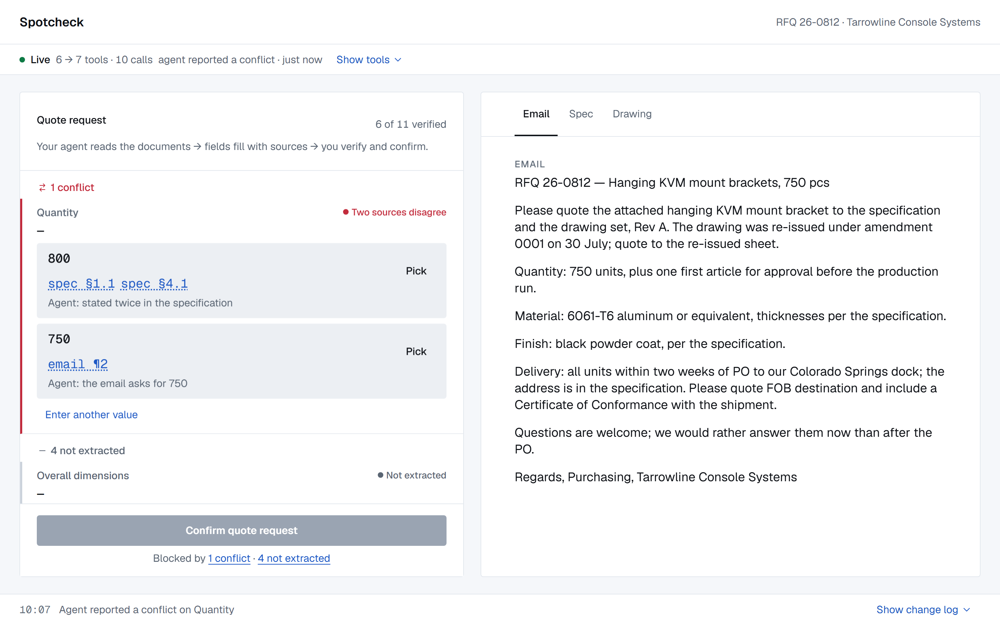

# Spotcheck

**Your agent reads the RFQ. You spot-check it.**



Spotcheck is a review workspace for manufacturing quote requests. A customer sends an RFQ package: an email, a purchase specification, a part drawing. Somebody in the shop has to turn that into eleven fields before anyone can price it, and an extraction error that nobody catches becomes a wrong price in the quote. That is why the estimator cannot take an extraction on trust, however good the agent is.

Here the agent does the reading. It works through the package with [WebMCP](https://webmachinelearning.github.io/webmcp/) tools that the page exposes, proposes a value for each field, attaches the exact place in the documents it took that value from, and flags where the sources disagree or say nothing. The estimator checks each flagged field against the highlighted source, fixes what is wrong, and confirms.

The agent can propose. Only a person can mark a field verified, change it, or confirm the quote request. That split is the whole point of the design.

Built for the [OpenAI WebMCP Challenge](https://webmcp.devpost.com/), August 25 to September 3, 2026.

## Try it

Live at **[spotcheck-rfq.vercel.app](https://spotcheck-rfq.vercel.app)**. The page carries one sample package: a public-domain RFQ for sheet-metal KVM mount brackets, wrapped in a fictional customer email (see `data/SOURCE.md`).

- **ChatGPT desktop app.** Open the URL in the built-in browser, Work mode. As of September 3, 2026 the model has to be GPT-5.6 Sol (Light or Medium) or GPT-5.6 Terra. Luna exposes no site tools; under it the page waits and nothing arrives. The status strip shows the prompt to type: `Extract this RFQ into a quote request`. Fields fill in as the agent reads; the Site tools panel in the address bar lists the page's tools, and its count changes from 6 to 7 when the agent hits a gap and gets the clarification tool.
- **Chrome 149 or later.** Enable `chrome://flags/#enable-webmcp-testing`, relaunch, open the URL and drive it with a WebMCP-capable agent. The Model Context Tool Inspector extension with a Gemini key runs the whole review, from the first read to the confirm screen.
- **Any other browser.** Press `Play sample session`. A session recorded with GPT-5.6 Sol replays through the same state machine, step by step, retries and rejections included, so the whole product is visible without an agent.
- **Your own package.** `Open your own package` in the status strip: paste the customer email and the specification, attach the drawing as PNG, JPEG or WebP, press `Open package`, and give your agent the same prompt. The drawing is an image only; an agent that cannot see it reports the drawing number and revision as missing, which is the right answer.

Add `?quiet=1` to the URL to drop the prompt-injection line from the sample email, for agents that stop on suspected injection.

## How WebMCP is used

One module, `src/webmcp-tools.ts`, registers every tool with `document.modelContext.registerTool(...)`. The contract is asymmetric on purpose. The agent gets tools to read the package, propose values, report conflicts and missing data, and draft a clarification email once gaps exist. Verifying, editing, resolving and confirming have no tool at all; they exist only as UI actions.

Some consequences of that contract, all visible in the page:

- Provenance is mandatory. The tool layer rejects a proposal without source references. Every value in the field pane links to the region it came from, and clicking the region focuses the field.
- A human decision is final. Once the estimator has acted on a field, every write tool gets a structured `FIELD_LOCKED` answer with the current value. The agent's differing proposal shows up as a suggestion card the person can apply or dismiss; it never overwrites.
- Tools follow the state. The page registers the clarification tool only while open gaps exist and unregisters it through its `AbortSignal` when the last gap closes. A browser that lists site tools shows the count move.
- Document text is untrusted. Read tools carry `untrustedContentHint`; the page renders document text and agent rationale as text, never as HTML. The sample email contains an instruction addressed to automated systems, and it has no effect, because no tool can reach the verified state.
- Nothing leaves the page except to the agent. `Content-Security-Policy: default-src 'self'; img-src 'self' data:`, `Permissions-Policy: tools=(self)`, no third-party scripts, fonts or analytics. The `data:` source covers images and nothing else: a part drawing someone attached, re-encoded in the browser. Reads are one section at a time and every read is logged, so the estimator sees exactly what the agent received.

## Stack

React 18, TypeScript, Vite. A static single-page app with no server. The reducer is a plain module with no React imports, behind a small store that exposes two dispatchers: one for the agent, one for the person. The tool module imports only the agent's.

## Development

```bash
pnpm install
pnpm dev          # local server
pnpm test         # unit tests (vitest)
pnpm e2e          # Playwright, against the production build
pnpm build
```

`docs/scenarios.md` lists the scenarios the tests and evals refer to. `evals/` holds cases in the `webmcp-evals` format, with instructions to run them against the live page. Design rules live in `DESIGN.md`; the tool contract and screen inventory in `build-spec.md`.

## What's next

Known gaps, roughly in the order to fix them:

- The tool layer accepts `unit` on `overall_dimensions` only, and the tool description says "the unit-bearing field" without naming it. Sol never tripped on this; Gemini sent a unit with two other fields and got `SCHEMA` back both times. One word in the description fixes it.
- The dialog caps each pasted document at 40,000 characters. Longer specifications need trimming before they go in.
- Drawings come in as PNG, JPEG or WebP. PDF sheets need a screenshot first.
- A user package's drawing has no transcribed regions, so the agent cannot cite anything on it. Region transcription, or a read tool that can see the image, is what that path needs next.
- No plausibility check on values. A quantity of 8000 where the email says 800 passes the tool layer as long as it has a source.
- Nothing guards against importing a session that was exported from a different package. The tool layer rejects every reference that does not resolve, and the rejections land in the log, but nothing warns up front.

## License

MIT. See [LICENSE](LICENSE).
